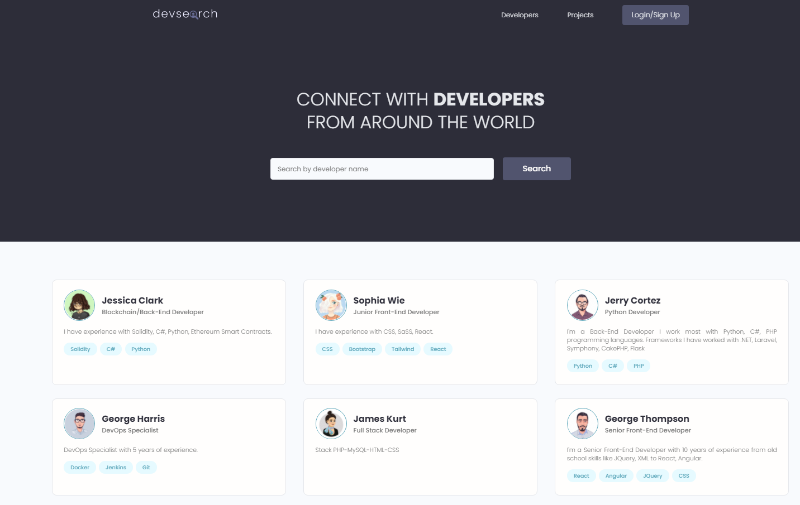
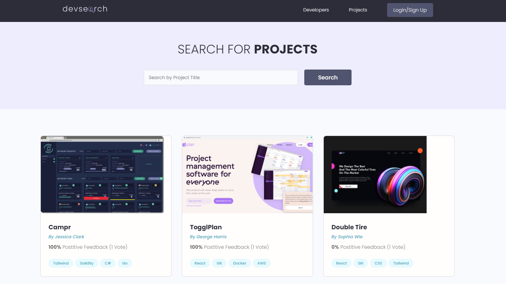
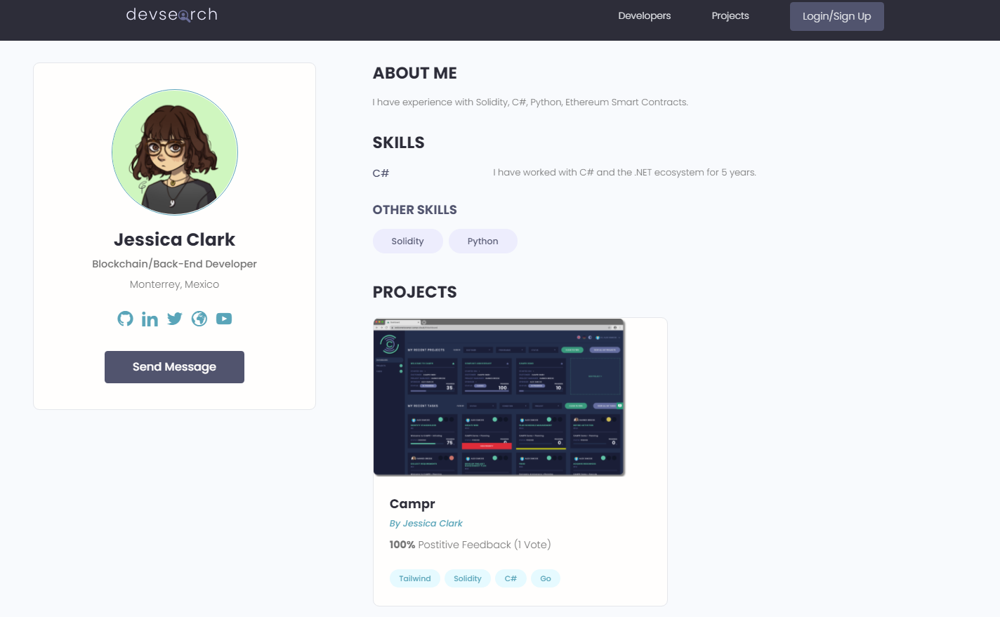
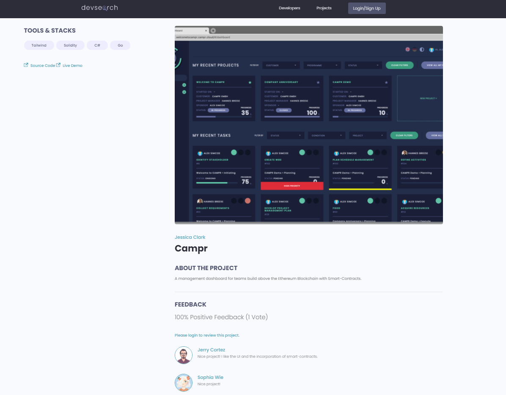
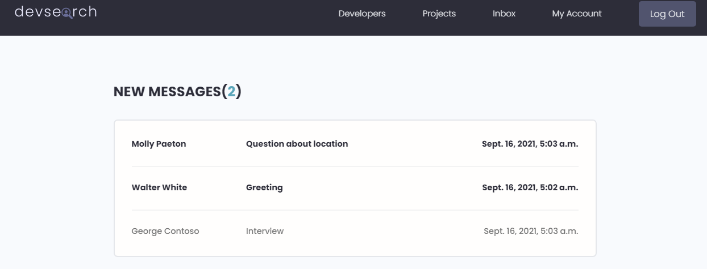
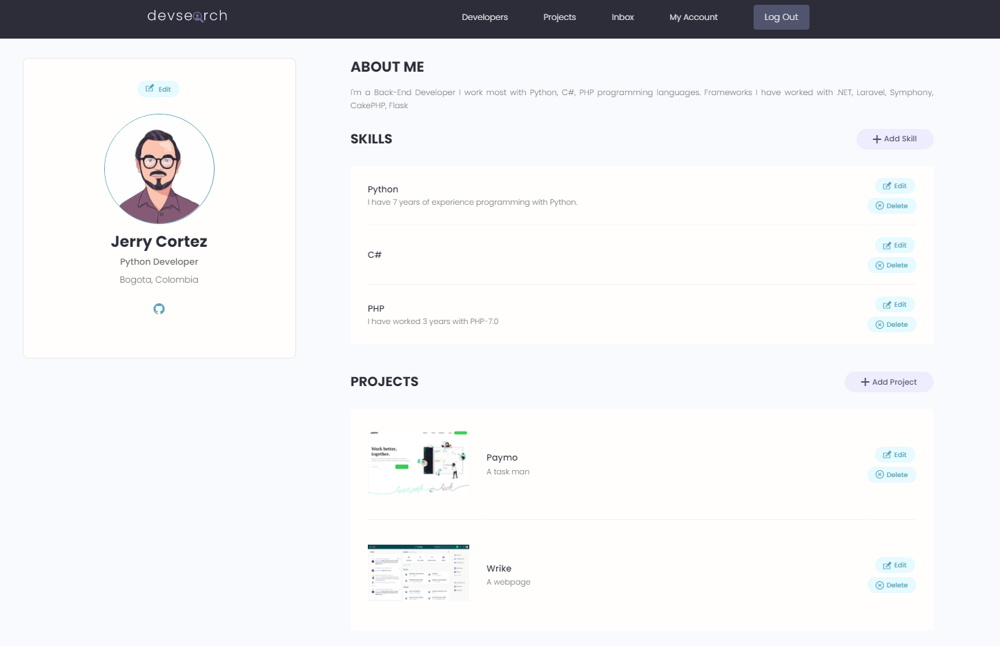

## DevSearch ☕🙂

This is a site built with Django a Python framework to search for Developers around the world. It was built with the purpose to practice my Python skills + framework Django.
I created a API with Django-REST framework.🙂😀

### Features ✔
* Login session using Django default.
* Register + Email verification + Forgotten Password recovery by Email link.
* Create, Read, Update, Delete functionality for Projects/Skills/Profiles.
* PostgreSQL database.
* Profile inbox messages.
* Search bar to look for Developers/Projects.

## Build with 🛠️
* [PostgreSQL](https://www.postgresql.org/) - Data Base.
* [Python 3.9](https://www.python.org/) - Backend Programming Language.
* [Django 3.2](https://www.djangoproject.com/) - Backend Framework.
* [Django REST Framework](https://www.django-rest-framework.org/) - API Rest Framework.

### Author 
[@Dev-OriolCC](https://github.com/Dev-OriolCC)

## Screenshots 📸

### Login
Created account to test:
Username: benjamin
Password: oriolcesar
